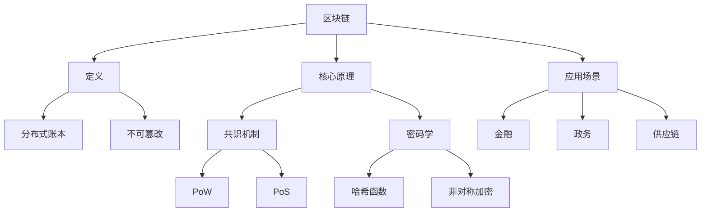

# 学习交互Agent - 产品需求文档(PRD)

## 文档信息
- **产品名称**: LearnMate - 深度学习交互Agent
- **版本**: v3.0
- **作者**:
- **日期**: 2026-03-10

---

## 1. 产品概述

### 1.1 产品背景

在信息爆炸的时代，用户面临着知识碎片化、学习效率低下的问题。传统的搜索引擎只能提供信息检索功能，无法帮助用户系统性地理解概念、建立知识关联并形成深度认知。

LearnMate 是一款基于大语言模型的CLI学习交互Agent，旨在帮助用户进行深度学习和知识管理。它不仅能够解释名词概念，还能引导用户进行深度思考，建立名词之间的知识关联，形成个性化的知识网络。

### 1.2 产品定位

- **产品类型**: CLI命令行工具 + AI Agent
- **核心价值**: 从名词出发，引导深度学习，建立知识关联，形成长期知识资产
- **目标用户**: 个人学习者、知识工作者、终身学习者

### 1.3 核心特性

1. **智能名词解释**: 自动搜集信息，提供准确的名词解释
2. **深度学习引导**: 通过提问和提示，引导用户进行深度思考
3. **知识图谱索引**: 建立名词间的Tag关联，形成知识网络
4. **双层记忆系统**: 长期记忆（知识库）+ 短期记忆（当前会话上下文）
5. **多轮交互**: 支持持续对话，跟随用户学习思路
6. **语境决策**: 用户可指定Agent在特定知识语境下思考
7. **私有文档支持**: 允许用户导入私有文档扩充知识库
8. **名词消歧处理**: 自动检测歧义词并引导用户明确意图
9. **学习总结与知识产出**: 自动生成学习总结、思维导图和知识报告
10. **学习路径规划**: 提供系统化的学习路径建议
11. **智能提醒系统**: 基于遗忘曲线和用户设置提醒复习
12. **学习统计分析**: 可视化展示学习进度和知识掌握情况

---

## 2. 用户故事

### 2.1 核心用户故事

| 编号 | 用户故事 | 优先级 |
|------|----------|--------|
| US-01 | 作为用户，我想输入一个名词（如"区块链"），让Agent帮我搜集信息并进行解释 | P0 |
| US-02 | 作为用户，我想Agent在解释后引导我进行深度思考，提出问题让我反思 | P0 |
| US-03 | 作为用户，我想查看我学习过的名词列表，并了解它们之间的关联 | P0 |
| US-04 | 作为用户，我想给名词打标签，让相同标签的名词相互关联 | P0 |
| US-05 | 作为用户，我想让Agent基于我已有的知识库回答问题，而不是从零开始 | P0 |
| US-06 | 作为用户，我想导入自己的文档（PDF/TXT/Markdown）到知识库 | P1 |
| US-07 | 作为用户，我想指定Agent在某个特定领域或语境下思考 | P1 |
| US-08 | 作为用户，我想查看某个名词的相关联名词和知识路径 | P1 |
| US-09 | 作为用户，当输入歧义词（如"苹果"）时，我想让Agent询问我具体指什么 | P1 |
| US-10 | 作为用户，我希望Agent能够修正错误的知识，并保留历史版本 | P1 |
| US-11 | 作为用户，我希望复习功能基于遗忘曲线安排复习时间 | P1 |
| US-12 | 作为用户，我想在学习完成后自动生成学习总结 | P1 |
| US-13 | 作为用户，我想为每个名词生成思维导图并导出 | P1 |
| US-14 | 作为用户，我想查看学习周期报告和知识掌握度 | P1 |
| US-15 | 作为用户，我想获得系统化的学习路径建议 | P1 |
| US-16 | 作为用户，我想设置提醒来督促自己学习 | P1 |
| US-17 | 作为用户，我想查看学习统计数据了解自己的学习情况 | P1 |
| US-18 | 作为用户，我希望系统记住我选择消歧义的偏好 | P1 |

---

## 3. 功能需求

### 3.1 名词学习模块

#### 3.1.1 名词解释功能

**功能描述**: 用户输入想要了解的名词，Agent自动搜集信息并进行解释。

**输入**:
- 名词（必填）: 如"区块链"、"机器学习"、"某公司名称"
- 领域限定（可选）: 如"金融"、"技术"、"医疗"

**处理流程**:
1. 检查本地知识库是否已存在该名词的解释
2. 如不存在，调用大模型API或搜索工具搜集信息
3. 生成结构化解释，包括：定义、背景、核心原理、应用场景、相关概念
4. 存储解释到知识库

**输出示例**:
```
=== 区块链 ===

📌 定义
区块链是一种分布式账本技术，通过密码学方法将数据块顺序相连，形成不可篡改的数据结构。

📌 核心原理
- 分布式账本：每个节点都保存完整的账本副本
- 共识机制：PoW、PoS、DPoS等
- 密码学：哈希函数、非对称加密

📌 应用场景
- 金融服务：跨境支付、供应链金融
- 数字资产：加密货币、NFT
- 政务：电子发票、政务公开

📌 相关概念
→ 比特币 | 智能合约 | DeFi
```

#### 3.1.2 深度学习引导

**功能描述**: 在名词解释后，Agent通过**苏格拉底式提问**引导学生进行深度思考，让学生通过自己推导答案，而非被动接收答案。这是系统的"灵魂"所在。

**核心原则**:

| 原则 | 说明 | 实现方式 |
|------|------|----------|
| **答案保留** | 默认不直接给答案 | 提问 → 提示 → 解释 |
| **学生中心** | 从学生当前理解出发 | 每轮诊断理解状态 |
| **小步推进** | 逐步拆解大问题 | 大问题→子问题→关键概念→结论 |
| **认知冲突** | 引导发现逻辑矛盾 | 反例、假设问题、极端情况 |
| **鼓励解释** | 要求说明推理过程 | "为什么？"、"依据是什么？" |
| **结构总结** | 最终必须总结 | 概念→规律→模型 |

##### 3.1.2.1 六类核心问题

| 类型 | 目标 | 示例 |
|------|------|------|
| **澄清问题** | 理解学生想法 | "你说的'效率'具体指什么？" |
| **假设问题** | 找出隐含假设 | "如果这个条件不成立会怎样？" |
| **证据问题** | 要求支持理由 | "有什么证据支持这个观点？" |
| **反例问题** | 测试理论稳固性 | "有没有可能出现相反情况？" |
| **推论问题** | 探索结论影响 | "如果正确，会带来什么结果？" |
| **元认知问题** | 训练反思思维 | "你对这个答案有多确定？" |

##### 3.1.2.2 对话流程

```
Step 1 诊断理解
  └─ "你现在对这个概念的理解是什么？"

Step 2 拆解问题
  └─ 核心问题 → 关键概念 → 子问题

Step 3 引导推理
  └─ 问题1 → 学生回答 → AI反馈+新问题 → 问题2 → ...

Step 4 识别错误
  └─ 不直接纠正，而是：提示 → 举反例 → 追问

Step 5 关键提示
  └─ Level 1: 提醒概念
  └─ Level 2: 指出关键变量
  └─ Level 3: 提供部分答案

Step 6 学生总结
  └─ "现在你能总结一下这个原理吗？"

Step 7 AI结构化总结
  └─ 概念 → 原理 → 应用
```

##### 3.1.2.3 行为规则

```
1 先问学生理解
2 提出小问题
3 要求解释推理
4 发现矛盾
5 提供最小提示
6 引导学生总结
7 AI最终结构化总结
```

##### 3.1.2.4 对话示例

```
学习主题：区块链

AI：你觉得区块链的核心价值是什么？

学生：我觉得是去中心化。

AI：很好，你说去中心化。那为什么去中心化很重要？

学生：因为没有中间商赚差价。

AI：如果只是没有中间商，那还有其他方式实现，为什么一定要用区块链？

学生：嗯...因为区块链不可篡改？

AI：没错！你抓住了另一个核心价值。不可篡改能带来什么？

学生：信任！大家不用互相认识也能合作。

AI：非常好！现在你能总结区块链的核心价值吗？

学生：去中心化、不可篡改，带来信任。

AI：✅ 总结得很好。区块链的核心价值正是：
   1. 去中心化 - 无需第三方
   2. 不可篡改 - 数据可信
   3. 可追溯 - 记录可查

这些特性共同解决了"信任"问题，使得陌生人之间也能协作。
```

**交互模式**:
- 解释后自动进入引导模式
- 用户可选择继续深入或跳过
- 支持"继续"、"跳过"、"换个角度"命令

#### 3.1.3 名词消歧处理

**功能描述**: 当用户输入的词汇存在多种含义时，Agent需要识别歧义并引导用户明确意图。

**歧义检测机制**:
- 建立常见歧义词词典，记录多义词及其可能的含义
- 结合用户当前语境（已学习的名词、设置的标签）进行推断
- 无法确定时，主动询问用户

**常见歧义类型**:

| 歧义词 | 可能含义 |
|--------|----------|
| 苹果 | 水果/苹果公司/苹果产品 |
| 比特币 | 加密货币/比特币网络 |
| 神经网络 | 生物神经网络/人工神经网络 |
| 契约 | 法律契约/物理术语 |

**用户选择界面设计**:

当检测到歧义时，Agent输出交互式选择菜单：

```
⚠️ 您输入的"苹果"可能有以下含义：
   [1] 苹果（水果）- 一种常见的水果
   [2] 苹果公司 (Apple Inc.) - 美国科技公司
   [3] Apple产品 - iPhone、Mac等电子设备

请输入编号（1-3）或输入您想表达的含义：
>
```

**领域限定命令格式**:

为减少歧义，支持以下领域限定方式：

1. **直接在名词后添加领域**:
   ```
   学习 苹果 公司
   学习 苹果 水果
   ```

2. **使用at符号限定**:
   ```
   学习 苹果@公司
   学习 苹果@水果
   ```

3. **使用方括号限定**:
   ```
   学习 苹果[商业]
   学习 苹果[食品]
   ```

**消歧策略优先级**:
1. 显式领域限定（最高优先级）
2. 用户历史消歧偏好（记忆用户之前的消歧选择）
3. 当前语境推断（基于已学习的名词）
4. 用户历史学习偏好
5. 默认最常见含义 + 提示用户可指定

#### 3.1.4 消歧词典动态更新与偏好记忆 【新增】

**动态更新机制**:

1. **用户选择记录**: 系统自动记录用户每次消歧选择，更新词典权重
2. **上下文学习**: 根据用户学习的历史词汇，动态调整消歧候选顺序
3. **偏好持久化**: 用户选择的消歧结果会保存到本地配置

**数据模型扩展**:
```python
class DisambiguationPreference:
    id: str                      # UUID
    term: str                    # 歧义词
    selected_meaning: str        # 用户选择的含义
    context: str                 # 选择时的上下文
    frequency: int               # 选择次数
    last_selected_at: datetime   # 最后选择时间
    created_at: datetime        # 首次选择时间

# 消歧词典动态权重
class DynamicDisambiguationWeight:
    term: str                    # 歧义词
    meaning: str                 # 含义
    weight: float               # 动态权重 (0.0-1.0)
    user_adjusted: bool          # 是否经过用户调整
    updated_at: datetime        # 更新时间
```

**命令扩展**:
```
/disambiguate show     # 查看消歧偏好设置
/disambiguate clear    # 清除消歧偏好
/disambiguate prefer 苹果 水果  # 优先选择水果含义
```

**偏好记忆示例**:
```
> 学习苹果

⚠️ 您输入的"苹果"可能有以下含义：
   [1] 苹果（水果）- 一种常见的水果
   [2] 苹果公司 (Apple Inc.) - 美国科技公司 [已优先]
   [3] Apple产品 - iPhone、Mac等电子设备

您之前多次选择"苹果公司"，已自动调整顺序。
请输入编号（1-3）或输入您想表达的含义：
> 2

✅ 已选择"苹果公司"。系统将记住您的偏好。
```

---

### 3.2 知识库模块

#### 3.2.1 知识存储

**数据模型**:

```python
# 名词表
class Term:
    id: str              # UUID (主键)
    name: str            # 名词名称
    definition: str      # 解释内容
    source: str          # 来源（web/doc/manual）
    source_url: str      # 来源URL（可追溯）
    created_at: datetime # 创建时间
    updated_at: datetime # 更新时间
    is_verified: bool    # 是否经过用户确认
    is_expired: bool     # 是否已过期（需要更新）
    mindmap: str         # 思维导图内容 【新增】
    summary: str         # 学习总结 【新增】

# 标签表
class Tag:
    id: str              # UUID (主键)
    name: str            # 标签名称
    color: str           # 标签颜色（可视化用）
    description: str     # 标签描述

# 名词-标签关联表
class TermTag:
    id: str              # UUID (主键)
    term_id: str         # 外键
    tag_id: str          # 外键
    created_at: datetime # 创建时间

# 名词-名词关联表
class TermRelation:
    id: str              # UUID (主键)
    source_term_id: str
    target_term_id: str
    relation_type: str   # related/similar/contrasting/causal
    created_by: str      # auto/user
    confidence: float    # 置信度 0-1
    created_at: datetime # 创建时间
```

#### 3.2.2 标签管理

**功能**:
- 创建/删除/重命名标签
- 给名词添加/移除标签
- 查看某标签下的所有名词
- 标签自动建议（基于名词内容相似度）

**命令示例**:
```
/tag create "技术" --color blue
/tag add "区块链" "技术"
/tag list
/tag view "技术"
```

#### 3.2.3 知识检索

**检索方式**:
1. **精确检索**: 按名词精确匹配
2. **模糊检索**: 按名称模糊搜索（使用SQL LIKE或全文检索）
3. **标签检索**: 按标签筛选
4. **语义检索**: 基于文本相似度（BM25算法）

**全文检索实现说明**:
- 使用SQLite FTS5（Full-Text Search）实现全文检索
- 支持关键词匹配、布尔运算、排序
- 不使用向量检索（v1.0约束）

#### 3.2.4 知识管理

**功能描述**: 对知识库中的名词解释进行更新、修订和版本管理。

**知识更新/修订**:

当用户发现解释错误时，可通过以下方式修正：

1. **手动编辑**:
   ```
   /edit 区块链
   # 进入交互式编辑器修改定义
   ```

2. **标记待审核**:
   ```
   /verify 区块链 false
   # 标记为待验证，后续可重新搜索确认
   ```

3. **请求重新搜索**:
   ```
   /refresh 区块链
   # 重新从网络搜集最新信息
   ```

**版本历史**:

每次修改都会创建新版本，保留历史记录：

```python
class TermVersion:
    id: str              # UUID
    term_id: str         # 外键
    definition: str      # 解释内容快照
    change_summary: str  # 变更说明
    version: int         # 版本号
    created_at: datetime # 创建时间
    created_by: str      # user/system
```

**版本查询命令**:
```
/history 区块链      # 查看修改历史
/rollback 区块链 2  # 回滚到第2版
/diff 区块链 1 3    # 对比第1版和第3版差异
```

**过期标记与更新**:

- 自动标记：基于知识类型设置TTL（如技术名词1年、生活常识永久）
- 手动标记：用户可手动标记某名词需要更新
- 过期提示：当用户查询过期名词时，提示"此解释可能已过时，是否更新？"

```
⚠️ 提示：您上次学习"区块链"是在2025年3月，内容可能已更新。
     输入 /refresh 区块链 获取最新解释
```

---

### 3.3 记忆系统

#### 3.3.1 长期记忆

**定义**: 保存在本地数据库中的结构化知识，包括：
- 用户学习过的名词解释
- 名词间的Tag关联
- 用户手动添加的笔记
- 导入的私有文档内容
- 版本历史记录
- 思维导图内容 【新增】
- 学习总结 【新增】
- 消歧偏好设置 【新增】

**存储方案**: SQLite + FTS5全文检索

**访问方式**:
- Agent可主动查询知识库
- 用户可通过命令查看/编辑知识库

#### 3.3.2 短期记忆

**定义**: 当前会话的上下文信息，包括：
- 当前会话中讨论的名词列表
- 用户的学习偏好
- 当前对话的历史摘要
- 用户明确表达的兴趣方向

**实现**: 会话级别的上下文窗口，会话结束后可选择保存到长期记忆

#### 3.3.3 记忆调用策略

**Prompt注入详细格式**:

```python
SYSTEM_PROMPT_TEMPLATE = """您是一位知识渊博的学习导师，擅长帮助用户进行深度学习和思考。

## 用户背景
- 用户已学习的名词: {learned_terms}
- 用户添加的标签: {user_tags}
- 当前设置的语境: {current_context}

## 会话历史摘要
{conversation_summary}

## 本次对话
用户说: {user_input}

## 回答要求
1. 优先使用用户知识库中的内容回答问题
2. 如果用户知识库中没有相关信息，明确告知用户
3. 适当引用用户已学习的关联概念
4. 引导用户进行深度思考
5. 保持友好、鼓励的语气
6. 如果发现用户知识库中的错误，委婉地指出并提供正确信息
"""

# 构建示例
def build_system_prompt(
    learned_terms: List[str],
    user_tags: List[str],
    current_context: str,
    conversation_history: List[dict],
    user_input: str
) -> str:
    learned_terms_str = ", ".join(learned_terms) if learned_terms else "无"
    user_tags_str = ", ".join(user_tags) if user_tags else "无"

    # 摘要对话历史（保留关键信息，压缩token）
    summary = summarize_conversation(conversation_history, max_tokens=500)

    return SYSTEM_PROMPT_TEMPLATE.format(
        learned_terms=learned_terms_str,
        user_tags=user_tags_str,
        current_context=current_context or "无",
        conversation_summary=summary,
        user_input=user_input
    )
```

**会话摘要策略**:
- 最近5轮对话保留完整内容
- 更早的对话压缩为摘要
- 提取关键名词、用户态度、待办事项

#### 3.3.4 记忆冲突仲裁规则

**冲突场景**:

1. **知识库 vs 大模型固有知识**:
   - 知识库内容优先（用户个人知识资产）
   - 大模型可建议修正，但不直接覆盖

2. **知识库内部冲突**:
   - 用户手动编辑的版本 > 系统自动生成的版本
   - 最新版本 > 历史版本
   - 已验证 > 未验证

3. **短期记忆 vs 长期记忆**:
   - 用户在会话中明确否认的内容 > 长期记忆
   - 会话中确认的新信息优先合并

**冲突处理流程**:
```
检测到冲突（知识库A vs 大模型B）
    │
    ▼
┌──────────────────┐
│ 检查冲突类型     │
└────────┬─────────┘
         │
    ┌────┴────┐
    ▼         ▼
知识库冲突   外部冲突
    │         │
    ▼         ▼
用户确认    提示用户
            "知识库显示X，但最新信息显示Y，您想更新吗？"
```

#### 3.3.5 短期记忆→长期记忆的转化

**转化时机**:
1. 用户明确执行保存命令
2. 会话结束时用户选择保存
3. 特定关键词触发（如"记住这个"）

**转化内容**:
- 用户在对话中补充的新名词解释
- 用户纠正的错误信息
- 用户标记的重要关联

**转化格式**:
```python
class MemoryTransfer:
    source_session_id: str
    target_term_id: str     # 关联到已有名词或新建
    content: str            # 待保存的内容
    transfer_type: str      # extend/correct/new
    user_confirmed: bool
    created_at: datetime
```

#### 3.3.6 增强：会话管理 【优化】

**会话持久化**:
- 支持保存和恢复会话状态
- 会话历史记录可查询
- 支持会话命名和标签

**命令扩展**:
```
/session save              # 保存当前会话
/session list             # 列出所有会话
/session load <id>        # 加载历史会话
/session delete <id>      # 删除会话
/session export <id>      # 导出会话
```

**会话数据模型**:
```python
class Session:
    id: str                # UUID
    name: str              # 会话名称
    mode: str              # learn/qa/review
    context: str           # 当前语境
    created_at: datetime   # 创建时间
    updated_at: datetime   # 最后活动时间
    messages: List[Message]  # 消息历史
    metadata: dict         # 额外元数据
```

---

### 3.4 多轮交互

#### 3.4.1 对话管理

**会话模式**:
1. **学习模式**: 默认模式，侧重解释和引导
2. **问答模式**: 用户提问，Agent基于知识库回答
3. **复习模式**: 回顾已学过的名词

**命令切换**:
```
/mode learn    # 切换到学习模式
/mode qa      # 切换到问答模式
/mode review  # 切换到复习模式
```

#### 3.4.2 上下文跟踪

**跟踪内容**:
- 当前会话中提到的所有名词
- 用户表达的兴趣方向
- 学习进度和路径

#### 3.4.3 复习模式算法

**复习策略**:

1. **艾宾浩斯遗忘曲线复习**:
   - 根据艾宾浩斯遗忘曲线模型安排复习时间
   - 记忆间隔：1天 → 3天 → 7天 → 14天 → 30天 → ...
   - 根据用户实际回忆表现动态调整间隔

   ```python
   # 复习间隔计算（天）
   INTERVALS = [1, 3, 7, 14, 30, 60, 120]

   class ReviewSchedule:
       term_id: str
       next_review_date: datetime
       current_interval_index: int  # 当前使用的间隔索引
       ease_factor: float           # 难度系数，默认2.5
       review_count: int            # 复习次数

   # 用户反馈后调整
   def update_schedule(user_rating: int):  # 0-5分
       if user_rating >= 4:
           # 记得牢，增加间隔
           current_interval_index += 1
       elif user_rating <= 2:
           # 记得差，减少间隔
           current_interval_index = max(0, current_interval_index - 2)
       # 更新下次复习时间
       next_review_date = now + INTERVALS[current_interval_index] * ease_factor
   ```

2. **随机复习**:
   - 从知识库中随机抽取名词
   - 适合日常巩固练习
   - 可指定抽取数量

   ```
   /review random 5    # 随机复习5个名词
   ```

3. **按标签复习**:
   - 复习特定标签下的所有名词
   - 适合按主题复习

   ```
   /review tag 技术    # 复习"技术"标签下的所有名词
   ```

4. **按时间复习**:
   - 复习最近学习的名词
   - 复习特定时间段内的名词

   ```
   /review recent      # 复习最近学习的内容
   /review period 2025-01 2025-03  # 复习2025年1-3月学习的内容
   ```

**复习交互流程**:
```
进入复习模式
    │
    ▼
显示复习名词: "区块链"
    │
    ▼
用户回答/回忆
    │
    ▼
┌──────────────────┐
│  用户评分 (0-5)  │
│  0: 完全忘记    │
│  3: 有印象      │
│  5: 完全记住    │
└────────┬─────────┘
         │
         ▼
    更新复习计划
         │
         ▼
    下一个名词 或 复习完成
```

**引导结束条件**:

1. **轮次限制**:
   - 默认每轮复习5个名词
   - 用户可自定义：`/review set 10`

2. **用户主动结束**:
   - 输入"退出"、"quit"、"结束"
   - 输入Ctrl+C

3. **用户行为判断**:
   - 连续3次选择"跳过" → 建议结束
   - 连续回答时间过长 → 提示休息

4. **复习完成**:
   - 当天计划的名词全部复习完毕
   - 显示复习统计

---

### 3.5 语境指定

#### 3.5.1 语境设置

**功能**: 用户可以指定Agent在特定的知识语境下进行思考和回答。

**实现方式**:

1. **指定标签语境**:
   ```
   /context set "技术"
   # Agent后续回答会聚焦在"技术"标签下的知识
   ```

2. **指定名词语境**:
   ```
   /context term "区块链"
   # Agent会以"区块链"为中心进行思考
   ```

3. **清除语境**:
   ```
   /context clear
   ```

**效果**:
- Agent在回答问题时会优先使用指定语境下的知识
- 引导问题时会更聚焦于相关领域
- 关联推荐会更精准

---

### 3.6 私有文档导入

#### 3.6.1 支持格式

| 格式 | 支持情况 |
|------|----------|
| TXT | ✅ 完全支持 |
| Markdown | ✅ 完全支持 |
| PDF | ✅ 支持文本提取 |
| DOCX | ✅ 支持文本提取 |

#### 3.6.2 导入流程

```
/import doc /path/to/document.pdf
# 自动提取文本内容
# 提示用户确认提取结果
# 用户指定文档中的关键名词
# 存入知识库
```

#### 3.6.3 文档解析

- PDF: 使用PyMuPDF或pdfplumber提取文本
- DOCX: 使用python-docx读取
- 自动分段分句，便于后续检索

---

### 3.7 信息搜集详细设计

#### 3.7.1 搜索源选择策略

**多源并行策略**:
- 搜索源：DuckDuckGo搜索、维基百科API、专业领域API
- 并行请求多个源，取可信度最高的结果
- 优先使用权威来源（官方文档、权威百科）

**搜索源优先级**:
```
1. 用户私有知识库（本地文档）
2. 用户指定的专业API
3. 维基百科/专业百科
4. 通用搜索引擎
5. 大模型固有知识（最后兜底）
```

#### 3.7.2 结果筛选与整合

**筛选标准**:
- 相关度评分（与名词的语义关联）
- 来源权威性（.edu/.gov > 知名媒体 > 普通网站）
- 时间有效性（优先最新内容）
- 多源验证（多个独立来源验证的信息更可信）

**整合流程**:
```
多个搜索结果
      │
      ▼
┌─────────────────┐
│  相关度排序    │ → 保留Top-N
└────────┬────────┘
         │
         ▼
┌─────────────────┐
│  来源权威性    │ → 加权评分
└────────┬────────┘
         │
         ▼
┌─────────────────┐
│  时间有效性    │ → 标记时效性
└────────┬────────┘
         │
         ▼
┌─────────────────┐
│  多源交叉验证  │ → 标注置信度
└────────┬────────┘
         │
         ▼
    生成结构化解释
```

**可追溯性记录**:
- 每个解释需记录来源URL
- 用户可查看信息出处
- 支持对单一来源进行质疑

```
📚 信息来源:
[1] 维基百科 - 区块链: https://en.wikipedia.org/wiki/Blockchain
[2] 区块链中文网: https://blockchain.com.cn/introduction
```

#### 3.7.3 优雅降级方案

**降级策略**:

| 场景 | 降级方案 |
|------|----------|
| 搜索API不可用 | 使用大模型固有知识 + 标注"未核实" |
| 大模型API不可用 | 返回本地缓存 + 提示稍后重试 |
| 完全无网络 | 返回本地知识库内容 + 提示无法获取新信息 |
| 部分来源失败 | 使用可用来源，标注缺失部分 |

**错误提示模板**:
```
⚠️ 当前网络不稳定，已使用本地知识库回答。
   部分信息可能非最新，是否需要稍后重试获取更新？ (y/n)
```

---

### 3.8 命令边界处理

#### 3.8.1 自然语言 vs 命令识别

**识别原则**:
1. 以`/`开头的输入 → 识别为命令
2. 以动词开头（学习、解释、查询）→ 识别为自然语言学习请求
3. 包含疑问词（是什么/为什么/如何）→ 识别为问答请求
4. 纯名词 → 尝试学习模式

**边界情况处理**:
- 用户输入"学习" → 提示输入具体名词
- 用户输入"/学习" → 提示命令格式错误，正确格式为`学习 <名词>`
- 用户输入过长 → 截取核心名词

#### 3.8.2 命令纠错

**模糊匹配**:
```
输入: /lst     → 建议: /list
输入: /viu     → 建议: /view
输入: /tag ad  → 建议: /tag add
```

**智能提示**:
```
输入: /mode    → 提示: 请指定模式类型: learn/qa/review
输入: /tag     → 提示: 请指定标签操作: create/add/remove/list/view
```

---

### 3.9 学习路径模块 【新增】

**功能描述**: 为用户提供系统化的学习路径规划和建议。

#### 3.9.1 学习路径生成

**基于名词关联自动生成**:
- 分析用户已学习名词的知识图谱结构
- 识别知识链条，生成推荐学习顺序
- 标记前置知识和进阶知识

**手动指定学习路径**:
```
/path create "区块链入门"
/path add 区块链入门 比特币
/path add 区块链入门 以太坊
/path add 区块链入门 智能合约
/path start 区块链入门
```

#### 3.9.2 路径推荐算法

```python
class LearningPath:
    id: str
    name: str
    description: str
    terms: List[str]           # 按顺序排列的名词列表
    estimated_time: int         # 预计学习时长（分钟）
    difficulty: str             # 难度等级: beginner/intermediate/advanced
    prerequisites: List[str]   # 前置知识要求

# 路径生成算法
def generate_path(target_term: str) -> LearningPath:
    # 1. 查找目标名词的知识图谱
    # 2. 识别所有关联名词
    # 3. 按依赖关系排序
    # 4. 过滤用户已掌握的词汇
    # 5. 生成推荐路径
```

#### 3.9.3 路径执行

**命令**:
```
/path list                       # 查看所有学习路径
/path view 区块链入门            # 查看路径详情
/path start 区块链入门           # 开始按路径学习
/path progress                  # 查看当前学习进度
/path recommend 区块链          # 获取区块链推荐学习路径
```

**交互示例**:
```
> /path recommend 区块链

📚 推荐学习路径: "区块链从入门到精通"

[阶段1] 基础概念（建议30分钟）
  1. 比特币 → 2. 分布式账本 → 3. 哈希函数 → 4. 非对称加密

[阶段2] 核心技术（建议45分钟）
  5. 共识机制 → 6. PoW → 7. PoS → 8. 智能合约

[阶段3] 进阶应用（建议60分钟）
  9. DeFi → 10. NFT → 11. 区块链+供应链

您已掌握: 比特币, 哈希函数
建议从 [阶段2] 开始学习

是否开始学习？ (y/n)
```

---

### 3.10 提醒系统模块 【新增】

**功能描述**: 基于学习计划和遗忘曲线，智能提醒用户进行学习和复习。

#### 3.10.1 提醒类型

1. **复习提醒**: 基于艾宾浩斯遗忘曲线自动安排
2. **学习提醒**: 用户设置固定时间的学习提醒
3. **目标提醒**: 学习目标达成的提醒

#### 3.10.2 提醒配置

**命令**:
```
/reminder add 复习    # 添加复习提醒
/reminder add 学习 --time 09:00  # 添加每日学习提醒
/reminder list       # 查看所有提醒
/reminder remove 1   # 删除指定提醒
/reminder clear      # 清除所有提醒
```

**配置示例**:
```yaml
reminders:
  review:
    enabled: true
    advance_notice: 30  # 提前30分钟提醒
    repeat: true

  study:
    enabled: true
    time: "09:00"      # 每天早上9点
    days: [1,2,3,4,5]  # 工作日

  goal:
    enabled: true
    check_interval: daily  # 每天检查
```

#### 3.10.3 提醒触发机制

**系统内提醒**:
- 进入程序时检查并显示待复习内容
- 桌面通知（系统支持时）
- 定期检查提醒配置

**提醒内容**:
```
🔔 提醒: 您有 5 个名词需要复习

今日复习计划:
  1. 区块链 (已过期3天)
  2. 机器学习 (今天到期)
  3. 深度学习 (今天到期)

输入 /review 开始复习
```

---

### 3.11 学习统计模块 【新增】

**功能描述**: 可视化展示用户的学习进度、知识掌握情况和成长曲线。

#### 3.11.1 统计数据类型

1. **学习概览**: 总名词数、标签数、学习时长
2. **学习趋势**: 每日/每周/每月学习数量变化
3. **知识掌握度**: 基于复习表现的掌握评分
4. **知识图谱统计**: 关联数量、聚类分析
5. **时间分布**: 学习时间段分布

#### 3.11.2 统计数据展示

**命令**:
```
/stats                # 显示综合统计
/stats today         # 今日学习统计
/stats week           # 本周学习统计
/stats month          # 本月学习统计
/stats knowledge      # 知识掌握度报告
/stats graph          # 知识图谱统计
/stats export         # 导 出统计数据
```

**统计展示示例**:
```
📊 学习统计报告 (2026年3月)

📈 本月概览
  学习新名词: 15个
  完成复习: 45次
  总学习时长: 8小时30分钟

📅 学习趋势
  ██████████░░░░░░░░  03/01  10个新名词
  ████████░░░░░░░░░░  03/08  8个新名词
  ████████████░░░░░░  03/15  12个新名词

🏷️ 标签分布
  技术: 25个 (45%)
  金融: 15个 (27%)
  其他: 16个 (28%)

📖 知识掌握度
  已掌握: 12个 (30%)
  学习中: 20个 (50%)
  待复习: 8个 (20%)
```

#### 3.11.3 数据模型

```python
class LearningStats:
    user_id: str
    date: date
    new_terms_count: int
    review_count: int
    study_duration: int      # 分钟
    tags_created: int

class MasteryScore:
    term_id: str
    mastery_level: float     # 0.0-1.0
    review_count: int
    average_rating: float    # 复习平均评分
    last_reviewed: datetime
```

---

### 3.12 兴趣点学习模块 【新增】

**功能描述**: 支持用户从多种类型的兴趣点出发（如论文、新闻、公司、行业、问题），自动提取其中的名词和知识点进行系统学习。

#### 3.12.1 支持的输入类型

| 类型 | 命令格式 | 说明 |
|------|----------|------|
| PDF论文 | `/learn paper <文件路径>` | 用户上传论文PDF，提取专业术语 |
| 新闻文章 | `/learn news <URL/文本>` | 用户提供新闻链接或文本，提取关键概念 |
| 公司 | `/learn company <公司名>` | 用户指定公司，深入了解相关知识 |
| 行业 | `/learn industry <行业名>` | 用户指定行业，深入了解相关知识 |
| 问题/疑问 | `/learn whatis <问题>` | 用户提出问题，自动拆解知识点 |

#### 3.12.2 内容解析模块

```
用户输入: 一篇PDF论文 / 新闻链接 / 公司名称 / 问题
    │
    ▼
┌──────────────┐
│ 内容提取     │──── PDF/文本/URL解析
└──────┬───────┘
       │
       ▼
┌──────────────┐
│ 名词提取     │──── NLP提取关键名词/术语
└──────┬───────┘
       │
       ▼
┌──────────────┐
│ 重要性排序   │──── TF-IDF/TextRank/大模型
└──────┬───────┘
       │
       ▼
┌──────────────┐
│ 兴趣推测     │──── 推测最可能感兴趣的名词
└──────┬───────┘
       │
       ▼
┌──────────────┐
│ 用户确认     │──── "您是想了解XXX吗？"
└──────────────┘
```

#### 3.12.3 名词提取算法

**规则方法**: 基于NLP的名词短语提取

- 使用NLP库（如spaCy、jieba）进行词性标注
- 提取名词、名词短语、专业术语

**统计方法**: TF-IDF、TextRank

- 计算词频和逆文档频率
- 使用TextRank算法提取关键词

**大模型方法**: 让LLM提取关键术语并排序

```python
# 名词提取Prompt模板
EXTRACTION_PROMPT = """请从以下文本中提取关键名词和术语，并按重要性排序。

文本内容:
{content}

要求:
1. 提取所有专业术语和技术名词
2. 按重要性从高到低排序
3. 返回JSON格式: {{"terms": [{"name": "术语名", "importance": 0.95, "reason": "提取理由"}, ...]}}
4. 提取数量控制在10-20个
"""
```

#### 3.12.4 兴趣推测策略

**上下文分析**:

- 标题、摘要、开头段落权重高
- 位置靠前的名词优先

**知识图谱关联**:

- 关联用户已学习名词
- 优先推荐与已有知识相关的术语

**热度排序**:

- 技术热点词优先
- 可配置热门词汇表

**用户历史**:

- 记忆用户学习偏好
- 推断用户兴趣方向

```python
class InterestPredictor:
    def predict(self, terms: List[Term], context: Dict) -> Term:
        # 1. 上下文权重计算
        position_weights = self._calculate_position_weights(terms)

        # 2. 知识图谱关联度
        graph_scores = self._calculate_graph_scores(terms, context.get('learned_terms', []))

        # 3. 热度权重
        hot_scores = self._calculate_hot_scores(terms)

        # 4. 用户历史偏好
        history_scores = self._calculate_history_scores(terms, context.get('user_preferences', {}))

        # 5. 综合排序
        final_scores = [
            (t, position_weights[i] * 0.3 + graph_scores[i] * 0.3 + hot_scores[i] * 0.2 + history_scores[i] * 0.2)
            for i, t in enumerate(terms)
        ]

        return max(final_scores, key=lambda x: x[1])[0]
```

#### 3.12.5 交互示例

**场景1: 论文学习**
```
> /learn paper ./ai_trends_2026.pdf

📄 正在解析论文...
✅ 已提取 25 个关键术语

🔍 您最可能感兴趣的是: "Transformer架构"
   (基于论文标题和摘要推断)

您想深入了解 "Transformer架构" 吗？ (y/n)
> y

=== Transformer架构 ===

[开始学习...]
```

**场景2: 新闻学习**
```
> /learn news https://example.com/tech-news

📰 正在解析新闻...
✅ 已提取 12 个关键术语

🔍 您最可能感兴趣的是: "大语言模型"
   (基于新闻热度推断)

您想深入了解 "大语言模型" 吗？ (y/n)
```

**场景3: 公司/行业学习**
```
> 学习 特斯拉

🏢 公司信息
- 创始人: Elon Musk
- 成立时间: 2003年
- 主营业务: 电动汽车、清洁能源

📚 相关知识领域
- 电动汽车技术
- 锂电池技术
- 自动驾驶
- 清洁能源

🔍 您最可能感兴趣的是: "自动驾驶技术"
您想深入了解 "自动驾驶技术" 吗？ (y/n)
```

**场景4: 问题学习**
```
> 学习 什么是量子计算

❓ 问题解析: "什么是量子计算"
提取到关键词: 量子计算 | 量子比特 | 叠加态

🔍 您最可能感兴趣的是: "量子计算"
您想深入了解 "量子计算"吗？ (y/n)
```

#### 3.12.6 命令设计

| 命令 | 说明 | 示例 |
|------|------|------|
| `/learn paper <路径>` | 学习PDF论文 | `/learn paper ./ai_trends.pdf` |
| `/learn news <URL/文本>` | 学习新闻 | `/learn news https://...` |
| `/learn company <公司名>` | 学习公司 | `/learn company 特斯拉` |
| `/learn industry <行业名>` | 学习行业 | `/learn industry 人工智能` |
| `/learn whatis <问题>` | 解析问题学习 | `/learn whatis 什么是量子计算` |

#### 3.12.7 数据模型

```python
# 兴趣点记录
class InterestPoint:
    id: str                      # UUID
    source_type: str             # paper/news/company/industry/question
    source_content: str         # 原始内容/URL
    extracted_terms: List[str]  # 提取的名词列表
    predicted_interest: str      # 推测的兴趣词
    user_confirmed: bool         # 用户是否确认
    confirmed_term: str         # 用户确认学习的名词
    created_at: datetime         # 创建时间

# 提取的术语
class ExtractedTerm:
    id: str
    interest_point_id: str      # 外键
    name: str                   # 术语名称
    importance: float           # 重要性分数 0-1
    source_position: int        # 在原文中的位置
    reason: str                 # 提取理由
    created_at: datetime
```

#### 3.12.8 技术实现

**parser/ 模块结构**:

```
parser/
├── __init__.py
├── base.py              # 解析器基类
├── pdf_parser.py        # PDF论文解析
├── news_parser.py       # 新闻解析
├── company_parser.py    # 公司信息解析
├── industry_parser.py   # 行业信息解析
├── question_parser.py   # 问题解析
└── factory.py           # 解析器工厂
```

**extractor/ 模块结构**:

```
extractor/
├── __init__.py
├── base.py              # 提取器基类
├── nlp_extractor.py     # NLP规则提取
├── statistical_extractor.py  # 统计方法提取
├── llm_extractor.py     # 大模型提取
└── ranker.py            # 重要性排序
```

**interest_predictor/ 模块结构**:

```
interest_predictor/
├── __init__.py
├── predictor.py         # 预测器主类
├── context_analyzer.py  # 上下文分析
├── graph_analyzer.py    # 知识图谱分析
├── hotness_analyzer.py  # 热度分析
└── history_analyzer.py  # 历史偏好分析
```

#### 3.12.9 配置扩展

```yaml
# 兴趣点学习配置
interest_learning:
  enabled: true

  # 名词提取配置
  extraction:
    max_terms: 20          # 最多提取名词数
    min_importance: 0.3   # 最小重要性阈值
    use_llm: true         # 是否使用大模型提取

  # 兴趣预测配置
  prediction:
    position_weight: 0.3      # 位置权重
    graph_weight: 0.3         # 知识图谱权重
    hotness_weight: 0.2       # 热度权重
    history_weight: 0.2       # 历史偏好权重

  # 支持的输入类型
  sources:
    pdf: true
    news: true
    company: true
    industry: true
    question: true
```

---

## 4. 非功能需求

### 4.1 性能需求

| 指标 | 要求 |
|------|------|
| 首次名词解释响应时间 | < 10秒（不含网络调用） |
| 知识库检索响应时间 | < 1秒 |
| 文档导入（10页PDF） | < 5秒 |
| 命令补全响应时间 | < 100ms |
| 思维导图生成时间 | < 5秒 |
| 统计报告生成时间 | < 3秒 |

### 4.2 可用性需求

- CLI交互流畅，输入输出清晰
- 支持命令补全（Tab键）
- 帮助文档完整
- 错误提示友好
- 支持快捷键操作

### 4.3 可扩展性

- 插件化设计，支持扩展搜索源
- 配置驱动，支持自定义Prompt模板
- 数据库schema可扩展

### 4.4 数据安全

- 本地数据存储，不上传云端
- 敏感信息加密存储（可选）
- 支持数据导出/导入

### 4.5 增强：隐私与安全 【优化】

#### 4.5.1 数据隐私

- 所有用户数据存储在本地
- 不收集任何用户学习数据
- 导出功能允许用户完全控制自己的数据

#### 4.5.2 安全增强

**API密钥安全**:
- 支持从环境变量读取API密钥
- 不在配置文件中明文存储敏感信息
- 支持密钥轮换提示

**本地数据加密**:
```yaml
security:
  encryption:
    enabled: true           # 启用数据加密
    algorithm: "AES-256-GCM"
    key_storage: "system_keychain"  # 系统密钥链存储

  api_keys:
    storage: "env"         # 仅从环境变量读取
    prompt_if_missing: true
```

#### 4.5.3 隐私控制命令

```
/privacy export    # 导出所有用户数据
/privacy delete    # 删除所有本地数据
/privacy status    # 查看隐私设置状态
```

### 4.6 性能优化 【新增】

#### 4.6.1 缓存策略

**多级缓存**:
1. **内存缓存**: 热点名词解释、用户偏好
2. **磁盘缓存**: 搜索结果、会话状态
3. **数据库缓存**: 查询结果

```python
# 缓存配置
cache:
  memory:
    max_size: 100           # 最大缓存项数
    ttl: 3600             # 过期时间(秒)

  disk:
    enabled: true
    path: "./data/cache"
    max_size_mb: 500
    ttl: 86400            # 24小时
```

#### 4.6.2 异步处理

- 搜索请求异步执行
- 文档导入后台处理
- 大模型调用支持超时配置

#### 4.6.3 数据库优化

- 索引优化：常用查询字段建立索引
- 查询优化：分页查询、延迟加载
- 定期维护：vacuum、analyze

---

## 5. 系统架构

### 5.1 整体架构

```
┌─────────────────────────────────────────────────────┐
│                    CLI 交互层                        │
│  (命令行解析 / 命令补全 / 彩色输出)                    │
└─────────────────────┬───────────────────────────────┘
                      │
┌─────────────────────▼───────────────────────────────┐
│                   Agent 核心层                       │
│  (意图识别 / 对话管理 / Prompt构建)                   │
└─────────────────────┬───────────────────────────────┘
                      │
        ┌─────────────┼─────────────┐
        ▼             ▼             ▼
┌───────────────┐ ┌───────────┐ ┌──────────────┐
│  知识库模块   │ │ 记忆模块   │ │ 信息搜集模块  │
│  (SQLite)     │ │ (Context) │ │ (Web/API)    │
└───────────────┘ └───────────┘ └──────────────┘
        │             │             │
        └─────────────┼─────────────┘
                      ▼
            ┌─────────────────┐
            │   大模型API层    │
            │ (OpenAI/Ollama) │
            └─────────────────┘
                      │
┌─────────────────────▼───────────────────────────────┐
│                   扩展功能层                          │
│  (学习路径 / 提醒系统 / 统计模块 / 思维导图)            │
└─────────────────────────────────────────────────────┘
```

### 5.2 模块设计

#### 5.2.1 CLI交互层 (`cli/`)

- `main.py`: 入口，命令行解析
- `commands/`: 各命令实现
- `formatters/`: 输出格式化
- `completer.py`: 命令补全

#### 5.2.2 Agent核心层 (`agent/`)

- `core.py`: Agent主逻辑
- `intent.py`: 意图识别
- `dialogue.py`: 对话管理
- `prompt.py`: Prompt模板管理

#### 5.2.3 知识库层 (`knowledge/`)

- `db.py`: 数据库操作
- `models.py`: 数据模型
- `search.py`: 检索逻辑
- `tags.py`: 标签管理
- `versioning.py`: 版本管理
- `mindmap.py`: 思维导图生成 【新增】

#### 5.2.4 记忆模块 (`memory/`)

- `short_term.py`: 短期记忆
- `long_term.py`: 长期记忆
- `context.py`: 语境管理
- `conflict.py`: 冲突仲裁
- `transfer.py`: 记忆转化
- `preference.py`: 用户偏好记忆 【新增】

#### 5.2.5 信息搜集层 (`fetcher/`)

- `web.py`: 网页抓取
- `api.py`: 外部API调用
- `docs.py`: 文档解析
- `aggregator.py`: 结果整合
- `fallback.py`: 优雅降级

#### 5.2.6 复习模块 (`review/`)

- `scheduler.py`: 复习计划调度
- `ebbinghaus.py`: 艾宾浩斯曲线实现
- `review_session.py`: 复习会话管理

#### 5.2.7 扩展功能层 (`features/`) 【新增】

- `learning_path/`: 学习路径模块
  - `path_generator.py`: 路径生成算法
  - `path_executor.py`: 路径执行管理

- `reminder/`: 提醒系统模块
  - `scheduler.py`: 提醒调度器
  - `notifier.py`: 通知管理器

- `statistics/`: 统计分析模块
  - `collector.py`: 数据收集器
  - `analyzer.py`: 数据分析器
  - `reporter.py`: 报告生成器

- `summary/`: 学习总结模块
  - `summarizer.py`: 总结生成器
  - `mindmap_generator.py`: 思维导图生成器

---

## 6. 数据流设计

### 6.1 名词学习流程

```
用户输入: "区块链"
     │
     ▼
┌──────────────┐
│ 名词消歧检测 │──── 歧义存在? ──→ 展示选择菜单 → 记住用户选择
└──────┬───────┘
       │ 无歧义
       ▼
┌──────────────┐
│ 检查知识库   │──── 已存在 ───► 返回缓存解释
└──────┬───────┘
       │ 不存在
       ▼
┌──────────────┐
│ 信息搜集模块 │──── 搜索/调用API
└──────┬───────┘
       │
       ▼
┌──────────────┐
│ 来源验证     │──── 记录来源URL
└──────┬───────┘
       │
       ▼
┌──────────────┐
│ 大模型生成   │──── 结构化解释
│   解释       │
└──────┬───────┘
       │
       ▼
┌──────────────┐
│ 存入知识库   │──── 持久化存储 + 版本记录
└──────┬───────┘
       │
       ▼
┌──────────────┐
│ 深度学习引导 │──── 生成引导问题
└──────┬───────┘
       │
       ▼
┌──────────────┐
│ 生成总结     │──── 自动生成学习总结 【新增】
│ 思维导图     │──── 自动生成思维导图 【新增】
└──────┬───────┘
       │
       ▼
   输出给用户
```

### 6.2 问答流程

```
用户提问: "区块链有什么应用场景？"
     │
     ▼
┌──────────────┐
│ 意图识别     │──── 确定问题类型
└──────┬───────┘
       │
       ▼
┌──────────────┐
│ 语境构建     │──── 加载长期记忆+短期记忆
└──────┬───────┘
       │
       ▼
┌──────────────┐
│ 知识库检索   │──── 找到相关名词 (精确/模糊/标签/语义)
└──────┬───────┘
       │
       ▼
┌──────────────┐
│ 冲突检测     │──── 知识库 vs 大模型?
└──────┬───────┘
       │
       ▼
┌──────────────┐
│ Prompt注入   │──── 构建完整Prompt
└──────┬───────┘
       │
       ▼
┌──────────────┐
│ 大模型回答   │
└──────┬───────┘
       │
       ▼
   输出给用户
```

### 6.3 学习总结与思维导图生成流程 【新增】

```
学习完成 "区块链"
     │
     ▼
┌──────────────┐
│ 提示确认     │
│ 🤔 是否需要生成学习总结？ (y/n)
└──────┬───────┘
       │ 用户确认
       ▼
┌──────────────┐
│ 生成总结     │
│ - 核心要点   │
│ - 关键词     │
│ - 与已有关联 │
│ - 实践建议   │
└──────┬───────┘
       │
       ▼
┌──────────────┐
│ 生成思维导图 │
│ - 定义       │
│ - 核心原理   │
│ - 应用场景   │
│ - 相关概念   │
└──────┬───────┘
       │
       ▼
┌──────────────┐
│ 存储         │
│ - 存入Term表 │
│ - 可导出     │
└──────┬───────┘
       │
       ▼
   输出给用户
```

---

## 7. 核心算法与逻辑

### 7.1 意图识别

**实现**: 基于规则 + 轻量模型

```python
# 意图类型
INTENT_LEARN = "learn"      # 学习新名词
INTENT_ASK = "ask"          # 提问
INTENT_TAG = "tag"          # 标签操作
INTENT_CONTEXT = "context"  # 语境设置
INTENT_IMPORT = "import"    # 导入文档
INTENT_REVIEW = "review"    # 复习
INTENT_SEARCH = "search"    # 搜索
INTENT_DISAMBIGUATE = "disambiguate"  # 消歧选择
INTENT_SUMMARY = "summary"  # 生成总结 【新增】
INTENT_MINDMAP = "mindmap"  # 思维导图 【新增】
INTENT_PATH = "path"        # 学习路径 【新增】
INTENT_REMINDER = "reminder"  # 提醒设置 【新增】
INTENT_STATS = "stats"      # 统计查看 【新增】
```

### 7.2 名词关联算法

**自动关联规则**:

| 规则 | 描述 | 例子 |
|------|------|------|
| 同一领域 | 名词在同一领域标签下 | 比特币、以太坊 → "加密货币" |
| 概念包含 | 一个概念包含另一个 | 机器学习包含深度学习 |
| 因果关系 | A导致B | 碳排放 → 全球变暖 |
| 对比关系 | A与B对立或对比 | 中心化 ←→ 去中心化 |

### 7.3 引导问题生成

**基于苏格拉底方法的六类问题模板**:

```python
SOCRATIC_GUIDE_TEMPLATES = {
    # 澄清问题 - 理解学生想法
    "clarification": [
        "你说的'{}'具体指什么？",
        "能否再解释一下你的想法？",
        "{}在这个语境下你是怎么理解的？"
    ],

    # 假设问题 - 找出隐含假设
    "assumption": [
        "你的结论是否假设了{}？",
        "如果这个条件不成立会怎样？",
        "{}成立的前提是什么？"
    ],

    # 证据问题 - 要求支持理由
    "evidence": [
        "你有什么证据支持这个观点？",
        "{}的依据是什么？",
        "有实验或数据支持吗？"
    ],

    # 反例问题 - 测试理论稳固性
    "counterexample": [
        "有没有可能出现相反情况？",
        "在极端条件下会发生什么？",
        "如果你的解释成立，那没有{}时会发生什么？"
    ],

    # 推论问题 - 探索结论影响
    "implication": [
        "如果这个理论正确，会带来什么结果？",
        "{}会产生什么影响？",
        "你能推断出下一步会发生什么吗？"
    ],

    # 元认知问题 - 训练反思思维
    "metacognition": [
        "你对这个答案有多确定？",
        "还有其他解释吗？",
        "你为什么会这样想？"
    ]
}
```

**提示层级系统**:

```python
class HintLevel:
    # Level 1: 提醒概念
    LEVEL_1_CONCEPT = "我给你一个提示：{}相关的核心概念是..."

    # Level 2: 指出关键变量
    LEVEL_2_VARIABLE = "关键在于理解{}和{}之间的关系..."

    # Level 3: 提供部分答案
    LEVEL_3_PARTIAL = "你可以这样理解：{}的本质是..."
```

### 7.4 歧义检测算法

**实现**:

```python
class DisambiguationDetector:
    # 常见歧义词词典
    AMBIGUOUS_WORDS = {
        "苹果": ["水果", "苹果公司", "Apple产品"],
        "比特币": ["加密货币", "比特币网络"],
        "神经网络": ["生物神经网络", "人工神经网络"],
        # ...
    }

    def detect(self, term: str, context: List[str]) -> Optional[List[str]]:
        # 检查是否在歧义词列表中
        if term not in self.AMBIGUOUS_WORDS:
            return None

        # 尝试根据用户偏好推断
        candidates = self.AMBIGUOUS_WORDS[term]
        user_preference = self._get_user_preference(term, context)

        if user_preference:
            # 将用户偏好的选项排在前面
            candidates = self._reorder_by_preference(candidates, user_preference)

        # 尝试根据上下文推断
        inferred = self._infer_from_context(context, candidates)

        if inferred:
            return inferred

        # 无法确定，返回候选列表让用户选择
        return candidates

    def _get_user_preference(self, term: str, context: List[str]) -> Optional[str]:
        # 从用户偏好记录中获取
        preference = db.query(DisambiguationPreference)
            .filter_by(term=term)
            .order_by(DisambiguationPreference.frequency.desc())
            .first()
        return preference.selected_meaning if preference else None
```

---

## 8. 用户交互流程

### 8.1 首次使用流程

```
$ learnmate

欢迎使用 LearnMate v3.0！
您可以输入想要学习的名词开始学习之旅。

输入示例:
  学习区块链
  解释 机器学习
  /help 查看更多命令

>
```

### 8.2 完整交互示例

```
> 学习区块链

=== 区块链 ===

📌 定义
区块链是一种分布式账本技术...

📌 核心原理
...

📌 相关概念
→ 比特币 | 智能合约 | DeFi

🤔 深度思考
你能用自己的话解释什么是"去中心化"吗？
（输入"继续"学习下一个，或输入具体问题）

> 继续

🤔 区块链和传统数据库相比，有什么优势？
（输入"继续"或"跳过"进入下一轮引导）

> 跳过

✅ 已将"区块链"添加到您的知识库

🤔 是否需要生成学习总结？ (y/n)
> y

📝 学习总结:

📌 核心要点
- 区块链是分布式账本技术
- 核心特性：去中心化、不可篡改、可追溯
- 共识机制确保多方信任

📌 关键词
#区块链 #分布式账本 #共识机制 #PoW #PoS

📌 与已有关联
→ 比特币（上游概念）

📌 实践建议
- 深入了解共识机制的优劣
- 研究DeFi应用场景

🗺️ 思维导图已生成，输入 /mindmap 区块链 查看

📎 您可以：
  /tag add 区块链 技术
  /view 区块链
  /mindmap 区块链
  /path recommend 区块链
  直接输入下一个名词开始学习
```

### 8.3 思维导图交互示例 【新增】

```
> /mindmap 区块链

# 区块链 思维导图

## 定义
- 分布式账本技术
- 不可篡改

## 核心原理
├── 共识机制
│   ├── PoW (工作量证明)
│   ├── PoS (权益证明)
│   └── DPoS (委托权益证明)
└── 密码学
    ├── 哈希函数
    └── 非对称加密

## 应用场景
├── 金融
│   ├── 跨境支付
│   └── 供应链金融
├── 政务
│   ├── 电子发票
│   └── 政务公开
└── 供应链
    ├── 商品溯源
    └── 物流追踪

> /mindmap 区块链 mermaid



> /mindmap 区块链 png
✅ 思维导图已导出到: ./exports/mindmap_区块链_20260310.png
```

### 8.4 复习模式示例

```
> /mode review

📚 复习模式已开启

今日待复习: 5个名词

[1/5] 区块链
请回忆：什么是区块链的核心原理？
（输入您的答案，或输入"查看"显示解释）
>

查看

📖 区块链 - 核心原理
- 分布式账本
- 共识机制
- 密码学

请评分 (0-5):
> 4

✅ 记得不错！下次复习安排在3天后。

[2/5] 机器学习
...
```

---

## 9. 命令参考

### 9.1 核心命令

| 命令 | 说明 | 示例 |
|------|------|------|
| `学习 <名词>` | 开始学习新名词 | `学习 区块链` |
| `学习 <名词>@<领域>` | 带领域限定学习 | `学习 苹果@公司` |
| `解释 <名词>` | 查看名词解释 | `解释 机器学习` |
| `/ask <问题>` | 基于知识库提问 | `/ask 区块链的应用场景` |
| `/search <关键词>` | 搜索知识库 | `/search 金融` |

### 9.2 标签命令

| 命令 | 说明 | 示例 |
|------|------|------|
| `/tag create <名称>` | 创建标签 | `/tag create AI` |
| `/tag add <名词> <标签>` | 添加标签 | `/tag add 区块链 AI` |
| `/tag remove <名词> <标签>` | 移除标签 | `/tag remove 区块链 AI` |
| `/tag list` | 列出所有标签 | `/tag list` |
| `/tag view <标签>` | 查看标签下所有名词 | `/tag view AI` |

### 9.3 语境命令

| 命令 | 说明 | 示例 |
|------|------|------|
| `/context set <标签/名词>` | 设置语境 | `/context set 技术` |
| `/context term <名词>` | 设置名词语境 | `/context term 区块链` |
| `/context clear` | 清除语境 | `/context clear` |
| `/context show` | 显示当前语境 | `/context show` |

### 9.4 知识库命令

| 命令 | 说明 | 示例 |
|------|------|------|
| `/list` | 列出所有已学名词 | `/list` |
| `/view <名词>` | 查看名词详情 | `/view 区块链` |
| `/import <文件>` | 导入文档 | `/import ./notes.md` |
| `/export` | 导出知识库 | `/export ./backup.json` |
| `/edit <名词>` | 编辑名词解释 | `/edit 区块链` |
| `/refresh <名词>` | 重新获取最新解释 | `/refresh 区块链` |
| `/history <名词>` | 查看版本历史 | `/history 区块链` |
| `/verify <名词> <true/false>` | 标记验证状态 | `/verify 区块链 false` |

### 9.5 思维导图命令 【新增】

| 命令 | 说明 | 示例 |
|------|------|------|
| `/mindmap <名词>` | 查看思维导图 | `/mindmap 区块链` |
| `/mindmap <名词> mermaid` | 导出Mermaid格式 | `/mindmap 区块链 mermaid` |
| `/mindmap <名词> markdown` | 导出Markdown格式 | `/mindmap 区块链 markdown` |
| `/mindmap <名词> png` | 导出PNG图片 | `/mindmap 区块链 png` |
| `/mindmap <名词> svg` | 导出SVG图片 | `/mindmap 区块链 svg` |
| `/export mindmaps` | 导出所有思维导图 | `/export mindmaps` |

### 9.6 学习路径命令 【新增】

| 命令 | 说明 | 示例 |
|------|------|------|
| `/path list` | 列出所有学习路径 | `/path list` |
| `/path create <名称>` | 创建学习路径 | `/path create AI入门` |
| `/path add <路径> <名词>` | 添加名词到路径 | `/path add AI入门 机器学习` |
| `/path start <路径>` | 开始按路径学习 | `/path start AI入门` |
| `/path recommend <名词>` | 获取推荐学习路径 | `/path recommend 区块链` |
| `/path progress` | 查看学习进度 | `/path progress` |

### 9.7 提醒系统命令 【新增】

| 命令 | 说明 | 示例 |
|------|------|------|
| `/reminder list` | 查看所有提醒 | `/reminder list` |
| `/reminder add 复习` | 添加复习提醒 | `/reminder add 复习` |
| `/reminder add 学习 --time 09:00` | 添加学习提醒 | `/reminder add 学习 --time 09:00` |
| `/reminder remove <id>` | 删除提醒 | `/reminder remove 1` |
| `/reminder clear` | 清除所有提醒 | `/reminder clear` |

### 9.8 统计命令 【新增】

| 命令 | 说明 | 示例 |
|------|------|------|
| `/stats` | 显示综合统计 | `/stats` |
| `/stats today` | 今日统计 | `/stats today` |
| `/stats week` | 本周统计 | `/stats week` |
| `/stats month` | 本月统计 | `/stats month` |
| `/stats knowledge` | 知识掌握度 | `/stats knowledge` |
| `/stats export` | 导出统计数据 | `/stats export` |

### 9.9 复习命令

| 命令 | 说明 | 示例 |
|------|------|------|
| `/mode review` | 进入复习模式 | `/mode review` |
| `/review random <数量>` | 随机复习 | `/review random 5` |
| `/review tag <标签>` | 按标签复习 | `/review tag 技术` |
| `/review recent` | 复习最近内容 | `/review recent` |
| `/review set <数量>` | 设置每轮复习数量 | `/review set 10` |

### 9.10 消歧命令 【新增】

| 命令 | 说明 | 示例 |
|------|------|------|
| `/disambiguate show` | 查看消歧偏好 | `/disambiguate show` |
| `/disambiguate clear` | 清除消歧偏好 | `/disambiguate clear` |
| `/disambiguate prefer <词> <含义>` | 设置消歧偏好 | `/disambiguate prefer 苹果 水果` |

### 9.11 会话管理命令 【新增】

| 命令 | 说明 | 示例 |
|------|------|------|
| `/session save` | 保存当前会话 | `/session save` |
| `/session list` | 列出所有会话 | `/session list` |
| `/session load <id>` | 加载历史会话 | `/session load abc123` |
| `/session delete <id>` | 删除会话 | `/session delete abc123` |

### 9.12 系统命令

| 命令 | 说明 | 示例 |
|------|------|------|
| `/mode <类型>` | 切换模式 | `/mode qa` |
| `/history` | 查看学习历史 | `/history` |
| `/help` | 显示帮助 | `/help` |
| `/clear` | 清除屏幕 | `/clear` |
| `/quit` | 退出程序 | `/quit` |

### 9.13 增强：帮助系统 【优化】

```
/help                    # 显示帮助首页
/help learn             # 学习相关帮助
/help mindmap           # 思维导图帮助
/help path              # 学习路径帮助
/help reminder          # 提醒系统帮助
/help stats             # 统计功能帮助
```

**帮助内容扩展**:

每个帮助主题包含：
- 功能描述
- 使用场景
- 命令示例
- 注意事项
- 相关命令链接

---

## 10. 配置与扩展

### 10.1 配置文件

```yaml
# config.yaml
llm:
  provider: "openai"  # openai/anthropic/ollama
  model: "gpt-4"
  api_key: "${OPENAI_API_KEY}"

knowledge:
  db_path: "./data/knowledge.db"
  fts_enabled: true

search:
  provider: "duckduckgo"
  max_results: 5
  sources:
    - duckduckgo
    - wikipedia

review:
  default_count: 5
  enable_ebbinghaus: true

ui:
  color: true
  show_suggestions: true

# 歧义词配置
disambiguation:
  enabled: true
  dictionary_path: "./data/ambiguity.json"
  remember_preferences: true  # 记住消歧选择

# 学习路径配置
learning_path:
  enabled: true
  auto_suggest: true

# 提醒系统配置
reminder:
  enabled: true
  notification_method: "system"  # system/email

# 统计配置
statistics:
  enabled: true
  retention_days: 365

# 隐私安全配置
security:
  encryption:
    enabled: false
  api_keys:
    storage: "env"

# 性能优化配置
performance:
  cache:
    memory:
      enabled: true
      max_size: 100
    disk:
      enabled: true
```

### 10.2 环境变量

```bash
export OPENAI_API_KEY="sk-..."
export ANTHROPIC_API_KEY="sk-ant-..."
export OLLAMA_BASE_URL="http://localhost:11434"
```

### 10.3 数据迁移 【增强】

**迁移场景**:
1. 版本升级迁移
2. 数据导入/导出
3. 跨设备数据同步

**迁移命令**:
```
/migrate export          # 导出全部数据
/migrate import <file>  # 导入数据
/migrate status         # 查看迁移状态
/migrate verify         # 验证数据完整性
```

**迁移数据内容**:
- 知识库（名词、标签、关联）
- 学习统计
- 用户偏好设置
- 思维导图数据
- 学习路径配置

---

## 11. 风险与约束

### 11.1 技术风险

| 风险 | 影响 | 缓解措施 |
|------|------|----------|
| 大模型API不稳定 | 服务不可用 | 支持多Provider切换 |
| 知识库数据丢失 | 用户资产丢失 | 定期备份机制 |
| 文档解析失败 | 部分内容无法导入 | 提供手动编辑入口 |
| 网络搜索失败 | 无法获取新信息 | 优雅降级到本地知识库 |
| 思维导图生成失败 | 功能不可用 | 降级到文本总结 |

### 11.2 设计约束

- 当前版本仅支持CLI界面
- 知识库为单机本地存储
- 语义搜索使用BM25方案（FTS5），不支持大规模向量匹配
- 消歧词典需要持续维护更新
- 思维导图导出PNG需要安装graphviz

### 11.3 边界情况处理

#### 11.3.1 网络异常处理

**场景分类**:

| 场景 | 检测方式 | 处理策略 |
|------|----------|----------|
| 网络超时 | 请求超时 | 重试3次，间隔递增 |
| DNS解析失败 | 域名无法解析 | 切换备用DNS或使用缓存 |
| 连接被拒绝 | 端口无法访问 | 提示服务不可用 |
| SSL证书错误 | 证书验证失败 | 降级到HTTP或跳过验证 |

**实现示例**:
```python
class NetworkFallback:
    def fetch_with_retry(self, url: str, max_retries: int = 3) -> Optional[Response]:
        for attempt in range(max_retries):
            try:
                return self._fetch(url)
            except TimeoutError:
                wait_time = 2 ** attempt  # 指数退避
                time.sleep(wait_time)
            except NetworkError as e:
                logger.warning(f"Network error: {e}")
                break

        # 所有重试失败，返回降级结果
        return self._fallback_response()
```

#### 11.3.2 API限流处理

**处理策略**:

1. **速率限制检测**:
   - 识别429状态码
   - 解析Retry-After头

2. **排队机制**:
   - 请求进入队列等待
   - 定时重试

3. **降级方案**:
   - 减少请求频率
   - 使用本地缓存
   - 提示用户稍后重试

**用户提示**:
```
⚠️ API请求过于频繁，已自动降低请求速度。
   请稍等片刻，您仍可继续使用本地知识库。
```

#### 11.3.3 数据备份与恢复

**备份策略**:

1. **自动备份**:
   - 每次重要操作后自动备份
   - 每日全量备份
   - 保留最近7天增量备份

2. **手动备份**:
   ```
   /backup create          # 创建手动备份
   /backup list           # 列出所有备份
   /backup restore <id>   # 恢复指定备份
   /backup export <path>  # 导出备份文件
   ```

**恢复流程**:
```
/backup restore latest
⚠️ 即将恢复最新备份，当前数据将被覆盖。
确认恢复? (y/n)
> y

✅ 恢复成功！已恢复到 2026-03-10 10:30:00 的状态
```

#### 11.3.4 数据损坏处理

**检测与修复**:

1. **数据完整性检测**:
   - 启动时检查数据库完整性
   - 校验关键表的外键关系

2. **损坏处理**:
   - 自动修复可修复的问题
   - 无法修复的提示用户从备份恢复

```
⚠️ 检测到数据库异常，正在尝试修复...
✅ 修复成功！

⚠️ 部分数据无法自动修复，建议从备份恢复。
   输入 /backup restore 查看可用备份
```

### 11.4 增强：错误处理 【优化】

#### 11.4.1 错误分类

| 错误类型 | 示例 | 处理策略 |
|----------|------|----------|
| 输入错误 | 无效命令、参数错误 | 提示正确用法 |
| 知识库错误 | 数据库连接失败 | 提示修复方法 |
| 网络错误 | API调用失败 | 优雅降级 |
| 权限错误 | 文件无权限 | 提示权限问题 |
| 资源错误 | 内存不足 | 提示清理建议 |

#### 11.4.2 错误提示模板

```
❌ 错误: 名词不存在
   您输入的"XXX"尚未学习过。
   输入"学习 XXX"开始学习

❌ 错误: 命令格式错误
   正确用法: /tag add <名词> <标签>
   示例: /tag add 区块链 技术

❌ 错误: 网络连接失败
   已切换到本地知识库模式。
   部分功能可能受限。

❌ 错误: 数据同步失败
   数据已临时缓存，将稍后重试。
   如问题持续，请检查网络连接。
```

#### 11.4.3 错误恢复机制

1. **自动重试**: 网络错误自动重试3次
2. **缓存降级**: API失败使用本地缓存
3. **手动恢复**: 提供回滚和重置选项
4. **日志记录**: 记录错误详情便于排查

---

## 12. 未来规划 (v3.0)

- [ ] Web界面
- [ ] 多设备同步
- [ ] 向量语义搜索
- [ ] 知识图谱可视化
- [ ] 协作学习功能
- [ ] 更多文档格式支持

---

## 附录

### A. 名词解释模板

```markdown
# {名词名称}

## 定义
{一句话定义}

## 背景
{产生背景/历史}

## 核心原理
- 要点1
- 要点2
- 要点3

## 应用场景
1. 场景1
2. 场景2

## 优劣势
| 方面 | 说明 |
|------|------|
| 优势1 | ... |
| 劣势1 | ... |

## 相关概念
- [[相关名词1]]
- [[相关名词2]]

## 延伸阅读
- [来源1](url)
- [来源2](url)
```

### B. Prompt模板示例

```python
SYSTEM_PROMPT = """您是一位知识渊博的学习导师，擅长帮助用户进行深度学习和思考。

当前知识背景：
- 用户正在学习：{current_terms}
- 用户已添加标签：{tags}
- 当前语境：{context}

回答要求：
1. 基于用户提供知识库回答
2. 适当引用关联概念
3. 引导用户进行深度思考
4. 保持友好、鼓励的语气
"""
```

### C. 消歧词典格式

```json
{
  "苹果": {
    "meanings": [
      {"id": "fruit", "name": "水果", "description": "一种常见的水果"},
      {"id": "company", "name": "苹果公司", "description": "美国科技公司"},
      {"id": "product", "name": "Apple产品", "description": "iPhone、Mac等电子设备"}
    ],
    "keywords": {
      "company": ["公司", "股票", "市值", "iPhone", "Mac", "CEO"],
      "fruit": ["水果", "食用", "营养", "果树"]
    }
  }
}
```

### D. 版本历史记录示例

```
# 区块链 版本历史

v3 (2026-03-10) - 当前版本
[系统] 自动更新 - 根据最新网络信息更新
来源: 维基百科, blockchain.com

v2 (2025-06-15)
[用户] 手动修正 - 补充了共识机制细节

v1 (2025-01-20)
[系统] 初始创建
来源: 网络搜索
```

### E. 思维导图导出格式示例

#### E.1 Mermaid 格式


#### E.2 Markdown 格式

```markdown
# 区块链 思维导图

## 定义
- 分布式账本技术
- 不可篡改

## 核心原理
├── 共识机制
│   ├── PoW (工作量证明)
│   └── PoS (权益证明)
└── 密码学
    ├── 哈希函数
    └── 非对称加密

## 应用场景
├── 金融
│   ├── 跨境支付
│   └── 供应链金融
├── 政务
│   ├── 电子发票
│   └── 政务公开
└── 供应链
    ├── 商品溯源
    └── 物流追踪
```

### F. 学习报告模板

```markdown
# 学习报告

## 基本信息
- 报告周期: 2026-03-01 ~ 2026-03-31
- 生成时间: 2026-03-10

## 学习概览
- 学习新名词: 15个
- 完成复习: 45次
- 总学习时长: 8小时30分钟

## 知识增长趋势
[学习数量图表]

## 知识掌握度
- 已掌握: 12个 (30%)
- 学习中: 20个 (50%)
- 待复习: 8个 (20%)

## 标签分布
- 技术: 25个 (45%)
- 金融: 15个 (27%)
- 其他: 16个 (28%)

## 建议
1. 建议加强"金融"领域的复习
2. 本月可尝试学习"区块链进阶"相关内容
```

---

## 版本变更记录

| 版本 | 日期 | 变更内容 |
|------|------|----------|
| v1.0 | 2026-01-10 | 初始版本 |
| v2.0 | 2026-03-01 | 增强消歧、复习功能、版本管理 |
| v3.2 | 2026-03-10 | 新增苏格拉底式学习引导，6大原则+6类核心问题+7步对话流程，为系统注入灵魂 |
| v3.1 | 2026-03-10 | 新增兴趣点学习模块，支持从论文/新闻/公司/行业/问题中提取知识点 |
| v3.0 | 2026-03-10 | 新增学习总结、思维导图、学习路径、提醒系统、统计分析功能 |
